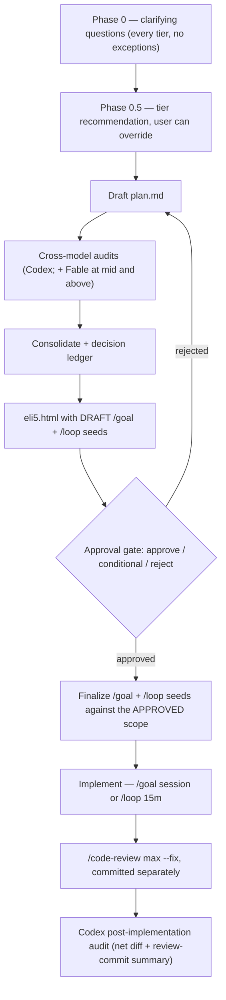

# blueprint

A plan-creation protocol for Claude Code with **four tiers of ceremony**. The core bet: the expensive part of non-trivial work is not typing the code — it's discovering mid-implementation that the plan was wrong. Blueprint front-loads that discovery with cross-model audits, explicit assumptions, and a human approval gate that cannot be hand-waved past.

> This README explains the concepts. The exact protocol the agent follows lives in [`SKILL.md`](SKILL.md) — if they ever disagree, SKILL.md wins.

## Invocation

```
/blueprint light | mid | deep | mega-deep
```

Also fires on phrases like "give me a plan", "plan this carefully", "ultraplan" — and auto-fires for high-risk surfaces (cross-package behavioral changes, infra with privilege impact, schema/protocol changes, auth, billing, migrations, public API changes).

## How the harness works

Every tier runs the same rails; tiers differ in how much adversarial pressure the plan survives before you see it.



Key mechanics, independent of tier:

- **Clarifying questions always come first.** No tier drafts before asking — including a validation-layers question (unit / integration / e2e / live-network e2e) asked *after* inspecting the project's real tooling, so the options offered actually exist.
- **Every implementation phase carries a validation gate**: exact commands from the project's own scripts + pass criteria + layers exercised. "Phase green" is defined by the plan, not vibes — which is what lets the agent implement solo: the loop validates against the plan's own gates instead of guessing, and validates in-step (fast layers after each meaningful edit), not just at phase end. The approval gate blocks plans with gateless phases.
- **Assumptions are structured** as *Facts* (verified), *Inferences* (derived, could be wrong), and *Asks* (need the human). The approval gate blocks while Asks are unresolved.
- **Security & Adversarial Considerations** is a mandatory plan section, fenced off from Assumptions so the two don't blur ("Assumptions is not a generic risk register; Security is not where uncertain facts go").
- **Cross-model auditing**: a second model family (Codex) reviews the plan. Two agents from the same family agreeing is not a signal; cross-family convergence is.
- **Model fallback**: the top-tier Claude leg ("fable") runs on Fable when available, else **Opus 4.8 (1M context)**. "fable" is the role name (the independent top-tier reviewer alongside Codex), not a hard model pin.
- **`eli5.html` is a hard prerequisite** — a standalone plain-language companion you can open in a browser, with "why this tier was chosen" and "approval decision needed" sections. No eli5, no approval ask. At the gate, the agent must print its absolute path + `file://` URL on standalone lines and open it (macOS) — the human never hunts for the plan.
- **Seeds are drafts until you approve.** After the gate (especially conditional approvals), the `/goal` and `/loop` strings are regenerated against the scope you actually approved, and delivered paste-ready.
- **Post-implementation**: `/code-review max --fix` runs first and commits separately, so the final Codex audit sees both the net diff and what the review pass changed — provenance preserved.

## What each tier adds

| | `light` | `mid` (default) | `deep` | `mega-deep` |
|---|---|---|---|---|
| **For** | bounded feature | contained feature | architectural / cross-cutting | novel surface nobody has mapped |
| **Drafting** | single plan | plan + one competing outline | **three parallel plans** (main, Codex, Fable), then consolidate | deep + **research subagents map the modules first** (persisted artifacts) |
| **Audit** | one Codex pass | Codex + Fable dual audit, then a **fresh-context** Codex pass that sees the decision ledger and rejected alternatives | dual audit + **contradiction-check** of the decision ledger | deep + Round 2: one resumed self-critique, one fresh hostile audit |
| **Floor** | ≥5 verified Facts, no silent Asks | decision ledger required | consolidation cannot be main-agent-only | research outputs are mandatory artifacts |

The tier recommendation uses a rubric: if **two or more** of *novelty, blast radius, irreversibility, migration cost, external coupling, security sensitivity* are high → `deep`. The user always has the final word.

Why "fresh-context" audits matter: a reviewer who watched the plan evolve is anchored on it. Blueprint deliberately sends final passes to sessions with no memory of the drafting, armed only with the consolidated plan, the rejected alternatives, and the unresolved disagreements.

## Execution seeds

The plan ships with two ready-to-paste strings:

- **`/goal`** — the primary: a completion condition checked every turn ("work until plan.md shows all phases ✓ and tests pass").
- **`/loop 15m`** — a fixed-interval driver whose prompt is *dispositional*, not goal-restating: never idle, pick the next task, consult Codex back-and-forth when stuck instead of waiting for the human, hard limits stay hard, wrap up with a report of every contentious decision debated.

## Artifacts

```
implementations-plan/<plan>/
├── plan.md            # the plan
├── audit-codex.md     # codex audit transcript
├── audit-fable.md     # fable audit transcript (mid+)
├── eli5.html          # plain-language companion + seeds
└── lessons/phase-N.md # per-phase debugging logs
```
