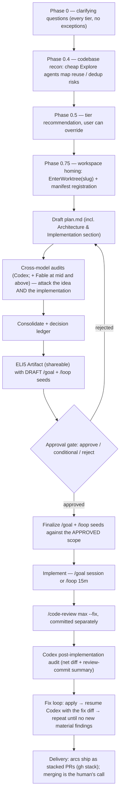

# blueprint

A plan-creation protocol for Claude Code with **four tiers of ceremony**. The core bet: the expensive part of non-trivial work is not typing the code — it's discovering mid-implementation that the plan was wrong. Blueprint front-loads that discovery with cross-model audits, explicit assumptions, and a human approval gate that cannot be hand-waved past.

> This README explains the concepts. The exact protocol the agent follows lives in [`SKILL.md`](SKILL.md) — if they ever disagree, SKILL.md wins.

## Invocation

```
/blueprint light | mid | deep | mega-deep
```

Also fires on phrases like "give me a plan", "plan this carefully", "ultraplan" — and auto-fires for high-risk surfaces (cross-package behavioral changes, infra with privilege impact, schema/protocol changes, auth, billing, migrations, public API changes).

## How the harness works

Every tier runs the same rails; tiers differ in how much adversarial pressure the plan survives before you see it.


```mermaid
flowchart TD
    Q["Phase 0 — clarifying questions (every tier, no exceptions)"] --> RC["Phase 0.4 — codebase recon: cheap Explore agents map reuse / dedup risks"]
    RC --> R["Phase 0.5 — tier recommendation, user can override"]
    R --> W["Phase 0.75 — workspace homing: EnterWorktree(slug) + manifest registration"]
    W --> D["Draft plan.md (incl. Architecture & Implementation section)"]
    D --> A["Cross-model audits (Codex; + Fable at mid and above) — attack the idea AND the implementation"]
    A --> C["Consolidate + decision ledger"]
    C --> E["ELI5 Artifact (shareable) with DRAFT /goal + /loop seeds"]
    E --> G{"Approval gate: approve / conditional / reject"}
    G -- "rejected" --> D
    G -- "approved" --> S["Finalize /goal + /loop seeds against the APPROVED scope"]
    S --> I["Implement — /goal session or /loop 15m"]
    I --> V["/code-review max --fix, committed separately"]
    V --> P["Codex post-implementation audit (net diff + review-commit summary)"]
    P --> F["Fix loop: apply → resume Codex with the fix diff → repeat until no new material findings"]
    F --> T["Delivery: arcs ship as stacked PRs (gh stack); merging is the human's call"]
```

Key mechanics, independent of tier:

- **Clarifying questions always come first.** No tier drafts before asking — including a validation-layers question (unit / integration / e2e / live-network e2e) asked *after* inspecting the project's real tooling, so the options offered actually exist.
- **Codebase recon before drafting.** After clarifying, cheap-but-clever read-only `Explore` agents (Sonnet-class) fan out to map what already exists — reuse-as-is, adapt-with-changes, and dedup risks — persisted to `recon.md`. The draft builds on it and the audits check against it, so plans extend the codebase instead of duplicating it.
- **Workspace homing before any artifact.** Once the tier is set, the session derives its slug and moves into a task-named git worktree (`.claude/worktrees/<slug>`, branch `worktree-<slug>`) via `EnterWorktree`, then registers in `~/.agents/workspaces.md` and keeps a one-line status current at every gate. One canonical clone, many named worktrees — no more `repo-1/-2/-3` clone sprawl; `agent-worktree list` answers "what is each one doing?", `agent-worktree resume <slug>` re-engages it.
- **Every implementation phase carries a validation gate**: exact commands from the project's own scripts + pass criteria + layers exercised. "Phase green" is defined by the plan, not vibes — which is what lets the agent implement solo: the loop validates against the plan's own gates instead of guessing, and validates in-step (fast layers after each meaningful edit), not just at phase end. The approval gate blocks plans with gateless phases.
- **Assumptions are structured** as *Facts* (verified), *Inferences* (derived, could be wrong), and *Asks* (need the human). The approval gate blocks while Asks are unresolved.
- **Security & Adversarial Considerations** is a mandatory plan section, fenced off from Assumptions so the two don't blur ("Assumptions is not a generic risk register; Security is not where uncertain facts go").
- **Architecture & Implementation is a mandatory plan section** — the engineering layer. Audits are told to attack not just the *idea* but the *build*: right structure? simpler pattern? wrong abstraction? leaky interfaces? It lives in `plan.md`, deliberately kept out of the human-facing ELI5.
- **Cross-model auditing**: a second model family (Codex) reviews the plan. Two agents from the same family agreeing is not a signal; cross-family convergence is.
- **Model fallback**: the top-tier Claude leg ("fable") runs on Fable when available, else **Opus 4.8 (1M context)**. "fable" is the role name (the independent top-tier reviewer alongside Codex), not a hard model pin.
- **The ELI5 companion is a hard prerequisite** — a plain-language view (why this tier, the phases, the approval ask, the seeds), no jargon and no technical detail (that's in `plan.md`). Primary form is a **shareable Claude Artifact** (a claude.ai URL, default-private, share when you choose); the fallback is a standalone `eli5.html` for when the Artifact tool isn't available or the plan must stay on your infrastructure — and that file is what the `BLUEPRINT_VIEW_CMD` remote-viewing hook serves (torn down right after the verdict; see SKILL.md "Remote viewing"). No ELI5, no approval ask.
- **Seeds are drafts until you approve.** After the gate (especially conditional approvals), the `/goal` and `/loop` strings are regenerated against the scope you actually approved, and delivered paste-ready.
- **Post-implementation**: `/code-review max --fix` runs first and commits separately, so the Codex audit sees both the net diff and what the review pass changed — provenance preserved. The Codex review is then a *loop*, not a pass: accepted fixes go back to the same Codex session with an explicit no-over-engineering rule, until a round yields nothing material (3 churning rounds → stop and surface). The whole protocol is written INTO plan.md, so a fresh implementing session can't forget it.
- **Arcs → stacked PRs**: phases are the unit of validation, arcs the unit of review. plan.md's Delivery section maps phases into arcs; multi-arc plans ship as a `gh stack` PR stack (drafts early for per-arc CI, cascade-rebase via `gh stack sync`), each PR one reviewable, revertable slice. `gh stack merge` lands a PR and everything under it — always the human's call.

## What each tier adds

| | `light` | `mid` (default) | `deep` | `mega-deep` |
|---|---|---|---|---|
| **For** | bounded feature | contained feature | architectural / cross-cutting | novel surface nobody has mapped |
| **Drafting** | single plan | plan + one competing outline | **three parallel plans** (main, Codex, Fable), then consolidate | deep + **research subagents map the modules first** (persisted artifacts) |
| **Audit** | one Codex pass | Codex + Fable dual audit, then a **fresh-context** Codex pass that sees the decision ledger and rejected alternatives | dual audit + **contradiction-check** of the decision ledger | deep + Round 2: one resumed self-critique, one fresh hostile audit |
| **Floor** | ≥5 verified Facts, no silent Asks | decision ledger required | consolidation cannot be main-agent-only | research outputs are mandatory artifacts |

The tier recommendation uses a rubric: if **two or more** of *novelty, blast radius, irreversibility, migration cost, external coupling, security sensitivity* are high → `deep`. The user always has the final word.

Why "fresh-context" audits matter: a reviewer who watched the plan evolve is anchored on it. Blueprint deliberately sends final passes to sessions with no memory of the drafting, armed only with the consolidated plan, the rejected alternatives, and the unresolved disagreements.

## Execution seeds

The plan ships with two ready-to-paste strings:

- **`/goal`** — the primary: a completion condition checked every turn ("work until plan.md shows all phases ✓ and tests pass").
- **`/loop 15m`** — a fixed-interval driver whose prompt is *dispositional*, not goal-restating: never idle, pick the next task, consult Codex back-and-forth when stuck instead of waiting for the human, hard limits stay hard, wrap up with a report of every contentious decision debated.

## Artifacts

```
implementations-plan/<plan>/
├── plan.md            # the plan (incl. Architecture & Implementation section)
├── recon.md           # Phase 0.4 recon: reuse / adapt / dedup map
├── audit-codex.md     # codex audit transcript
├── audit-fable.md     # fable audit transcript (mid+)
├── eli5.html          # ELI5 FALLBACK (primary is a shareable Claude Artifact) + seeds
└── lessons/phase-N.md # per-phase debugging logs
```
