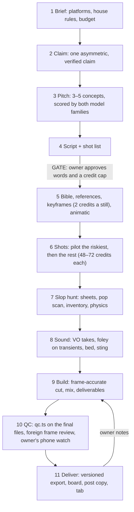

# commercial

A **production protocol for short AI video ads** made with the [Higgsfield CLI](https://github.com/higgsfield-ai/cli): Seedance 2.5 shots generated between Nano Banana Pro keyframes, generated voice, foley and music, and a frame-accurate ffmpeg build. It came out of making a 30-second spot end to end: four cuts, three rounds of owner notes, 577 credits. Every rule in it traces to a defect that shipped to a reviewer, or a credit that didn't need spending.

> This README explains the concepts. The protocol lives in [`SKILL.md`](SKILL.md); if they disagree, SKILL.md wins.

## Invocation

```
/commercial   # one flow for one spot of about 10–60 s
```

## The pipeline



## The ideas that matter

- **Decide where it's cheap.** A retake costs as much as 30 stills, and a word costs nothing. So the protocol pushes every decision down to the cheapest layer that can show the problem: the script before stills, stills before shots, and an ffmpeg retime before a regeneration. On the reference spot, 11 of 20 defects were fixed in the build for nothing.
- **Design slop out.** Video models fail predictably. Objects missing from the start frame materialise, falling things drift like feathers, counted props multiply or vanish, text turns to glyphs, and process verbs ("sweeps", "arrives") get skipped. The shot list is written against those failures, and every prop carries an expected-failure list that becomes a clause in every prompt.
- **Four checks, disjoint blind spots.** Scans rank candidates, and the driver checks staging and timing. The foreign reviewer (`/codex` from Claude Code, `/claude` from Codex) reads frames for continuity and lettering. The owner watches on a phone, the only view that catches motion at speed and the only one that hears the mix. Each found defects the others passed.
- **Money is capped and tracked, not estimated.** Every paid job goes through `hf.ts`. It reserves the quote against the owner-approved cap under a lock, records the job id the moment it exists, downloads atomically, and settles. A failed wait is resumed, never resubmitted. `ledger.ts` reconciles by job id against the account, so another session's spend on a shared account shows up with a name.
- **Claims are winks on screen, citations in the thread.** For comparative ads the protocol uses one asymmetric claim per spot, verified at the primary source. The film never carries the rival's marks.

## Files

| Path | What it is |
|---|---|
| [`SKILL.md`](SKILL.md) | The flow: setup, money, sections 1–12, hard rules |
| [`references/prompts.md`](references/prompts.md) | Prompt patterns for references, keyframes, edits, shots, foley, music and VO |
| [`references/gotchas.md`](references/gotchas.md) | Every trap that bit, with its fix: models, ffmpeg, audio, shell and CLI |
| [`references/review-prompt.md`](references/review-prompt.md) | The frame-level foreign-review prompt, and how to triage its findings |
| [`references/board.md`](references/board.md) | The review board's sections, media limits and downloads |
| [`scripts/hf.ts`](scripts/hf.ts) | One capped, logged generation: price, reserve, submit, wait, download, settle; `--resume` / `--release` for failures |
| [`scripts/ledger.ts`](scripts/ledger.ts) | The credit tab per spot (spent, open, cap), reconciled against the account's job list |
| [`scripts/animatic.ts`](scripts/animatic.ts) | Keyframes cut to time with scratch audio, to check pacing and crops before shots are paid for |
| [`scripts/qc.ts`](scripts/qc.ts) | Machine checks on the final files: frames, fps, loudness and true peak on the AAC, SRT order |
| [`scripts/export.ts`](scripts/export.ts) | Versioned, no-overwrite publishing into an exports folder, with a verified SHASUMS256 |
| [`scripts/popscan.ts`](scripts/popscan.ts), [`popcrops.ts`](scripts/popcrops.ts) | Pop-in detector and its before/at/after crop strips |
| [`scripts/reviewpack.ts`](scripts/reviewpack.ts) | A cut unpacked into numbered frames and one-second contact sheets |
| [`scripts/transient.ts`](scripts/transient.ts) | Onset, peak and loudness of a sound, for frame-accurate foley |
| [`scripts/sheet.sh`](scripts/sheet.sh), [`thumbs.ts`](scripts/thumbs.ts) | Eight-frame take sheets; data-URI thumbnails for boards |
| [`scripts/lib.ts`](scripts/lib.ts) | Shared helpers: the ledger's lock and validated fold, the CLI's JSON output, FFmpeg path and probe checks |
| [`templates/build.ts`](templates/build.ts) | The spot build over a named timeline of shot / still / freeze segments: grade, supers, ducked two-pass linear mix, 16:9 / clean / 1:1 / SRT, alternate takes, with guards that refuse anything silently wrong |

## Requirements

`higgsfield` (logged in), `bun` 1.4+, `ffmpeg`/`ffprobe` with libx264, `curl`, and a font for the supers. The foreign reviewer's CLI (`codex` or `claude`) must be logged in.
