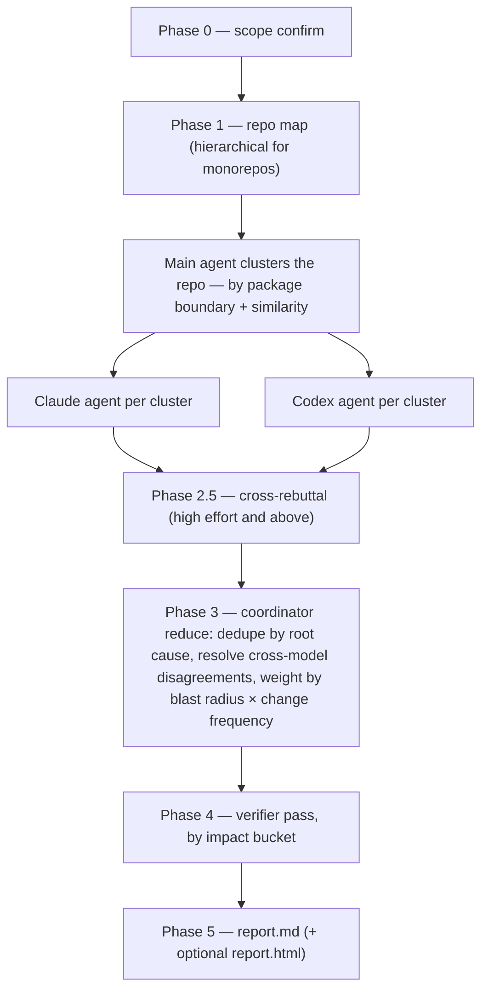

# harden-quality

A **whole-codebase maintainability audit** — not a diff review, not a bug hunt. One focus (quality), five effort levels (`low` → `ultra`). Built as a map-reduce over parallel cross-model agents with a coordinator-of-specialists shape, drawing on the multi-agent auditing literature (RepoAudit's inter-procedural context caps, Cloudflare's coordinator pattern and ~1.2-findings-per-cluster density target, diverse-ensemble verification).

> This README explains the concepts. The exact prompt and protocol live in [`SKILL.md`](SKILL.md) — if they ever disagree, SKILL.md wins.

## Why it exists as a separate skill

`/harden` bundles three focuses (security / bugs / quality) into one skill. That means running a quality pass through it pulls the security prompt into context too — and Fable ships extra safety measures for dual-use capabilities, so a combined run gets deflected or downgraded off Fable. `harden-quality` is a faithful clone of the harness with **every trace of security language removed**, so it runs clean on any model, Fable included. Same phases, same cross-model rigor, maintainability only.

## Invocation

```
/harden-quality [low|medium|high|max|ultra]   # effort defaults to high
```

A finding qualifies only if the code currently works and the issue is future-change cost — a concrete smell with a NAMED mapping (Fowler's Refactoring catalog or a named close analog). Correctness bugs go to `/harden-bugs`.

## How the harness works



The design decisions that matter:

- **Map before audit.** A structured repo map (entrypoints, coupling surfaces, dependency cycles, apparent duplication, generated-code exclusions) is built first; agents audit *clusters* derived from it, never random files. Monorepos get two-level hierarchical mapping so one bad map can't poison every downstream phase.
- **Cross-model always.** Every cluster gets a Claude agent *and* a Codex agent, at every effort level. Two same-family agents agreeing means nothing; cross-family convergence is the strongest confidence signal available, and disagreement is itself recorded as a signal.
- **Named smell or it doesn't exist.** Every finding needs a Fowler catalog name or a named close analog with the mapping explained. "Could be cleaner" is a non-finding by construction. Conventions are not smells unless they cost something — the negative list enforces this and cuts more false positives than any prompting trick.
- **Bounded context.** In-cluster traces cap at ~4 functions of inter-procedural depth (beyond that, hallucination rates spike), with an escalation rule for handoff edges so cross-module coupling doesn't vanish at cluster boundaries.
- **Dedupe by root cause, not location.** One duplicated helper copied across 5 files is one finding with 5 `instances` — remediation scope stays accurate without inflating counts.
- **Anchoring-guarded verification.** The verifier re-reads the source and states its own conclusion *before* seeing the original claim, ordered by impact bucket so a lone architectural smell is never crowded out by many local ones. Dead-code claims are only confirmed after checking DI / reflective registration.

## What each effort level differentiates

Effort scales **agent intelligence and depth, never phase composition** — all phases run at every level.

| Effort | Map | Per-cluster agents | Cross-rebuttal | Coordinator | Verification |
|---|---|---|---|---|---|
| `low` | Haiku | Claude Haiku + Codex (minimal) | — | Sonnet | top 3 |
| `medium` | Sonnet | Claude Sonnet + Codex (medium) | — | Sonnet | top 5 |
| `high` ← default | Sonnet | Claude Sonnet + Codex (xhigh) | light | Fable | top 10 |
| `max` | Fable | Claude Fable + Codex (xhigh) | full | Codex xhigh | all structural+ |
| `ultra` | Fable | 2× Claude Fable + 2× Codex, independent passes | full + Round 2 push-back | Codex xhigh | everything |

The coordinator deliberately switches family at `max`+: the map phase becomes Claude-heavy there, so a Codex judge at the reduce stage catches what Anthropic-family models share as blind spots. Fable is the top-tier Claude model; runs fall back to Opus 4.8 (1M context) only if Fable is unavailable.

## Severity (maintenance impact + weighting)

Priority = scope bucket (architectural / structural / local / cosmetic) × blast radius × change frequency. A local smell touched weekly outranks a dormant architectural one — the findings table sorts by computed priority, not just scope.

## Output

```
audit/quality/<YYYY-MM-DD>-<run-id>/
├── raw/         # repo map + per-cluster agent outputs (+ rebuttals)
├── findings/    # consolidated.md, verified.md
├── report.md    # engineering-facing (always)
└── report.html  # stakeholder-facing (optional)
```

The optional HTML report leads each finding with a three-paragraph plain-language ELI5 (what it is, what gets harder to change, the fix) and tucks the technical trace behind a collapsible — built for the person who must prioritize refactors without reading code.

## What it is NOT

Not a diff reviewer (use a code-review tool), not a bug hunt (use `/harden-bugs`), not a performance pass, not idempotent (cross-run agreement is signal). It is domain-agnostic — app, backend, and smart-contract code are all in scope.
