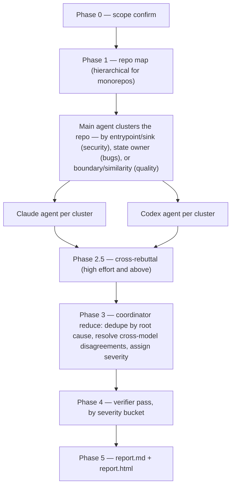

# harden

A **whole-codebase audit** skill — not a diff review. Three focuses (`security` / `bugs` / `quality`), five effort levels (`low` → `ultra`). Built as a map-reduce over parallel cross-model agents with a coordinator-of-specialists shape, drawing on the multi-agent auditing literature (RepoAudit's inter-procedural context caps, Cloudflare's coordinator pattern and ~1.2-findings-per-cluster density target, diverse-ensemble verification).

> This README explains the concepts. The exact prompts and protocol live in [`SKILL.md`](SKILL.md) — if they ever disagree, SKILL.md wins.

## Invocation

```
/harden <security|bugs|quality> [low|medium|high|max|ultra]   # effort defaults to high
```

The routing rule, since every finding belongs to exactly one focus: **security** if an untrusted or over-privileged actor can violate confidentiality, integrity, authorization, or availability; **bugs** if normal operation produces wrong results without an adversary; **quality** only if behavior is correct and the issue is change cost. Ties go to security.

## How the harness works



The design decisions that matter:

- **Map before audit.** A structured repo map (entrypoints, trust boundaries, dependency edges, generated-code exclusions) is built first; agents audit *clusters* derived from it, never random files. Monorepos get two-level hierarchical mapping so one bad map can't poison every downstream phase.
- **Cross-model always.** Every cluster gets a Claude agent *and* a Codex agent, at every effort level. Two same-family agents agreeing means nothing; cross-family convergence is the strongest confidence signal available, and disagreement is itself recorded as a signal.
- **Evidence or it doesn't exist.** Security findings need a concrete source→sink trace; bugs need a minimal counter-example; quality needs a named smell (Fowler catalog or a mapped analog). "Could be vulnerable" is a non-finding by construction. Negative lists (what NOT to flag) cut more false positives than any prompting trick.
- **Bounded context.** In-cluster traces cap at ~4 functions of inter-procedural depth (beyond that, hallucination rates spike), with an escalation rule for handoff edges (event→listener, DI inject→consumer, hook→handler) so event-driven flows don't vanish at cluster boundaries.
- **Dedupe by root cause, not location.** The same flaw in 5 places is one finding with 5 `instances` — remediation scope stays accurate without inflating counts.
- **Anchoring-guarded verification.** The verifier re-reads the source and states its own conclusion *before* seeing the original claim, ordered by severity bucket so a lone Critical is never crowded out by many Highs. Low-confidence Criticals get relabeled `Potential Critical`, never silently kept.

## What each effort level differentiates

Effort scales **agent intelligence and depth, never phase composition** — all phases run at every level.

| Effort | Map | Per-cluster agents | Cross-rebuttal | Coordinator | Verification |
|---|---|---|---|---|---|
| `low` | Haiku | Claude Haiku + Codex (minimal) | — | Sonnet | top 3 |
| `medium` | Sonnet | Claude Sonnet + Codex (medium) | — | Sonnet | top 5 |
| `high` ← default | Sonnet | Claude Sonnet + Codex (xhigh) | light | Fable | top 10 |
| `max` | Fable | Claude Fable + Codex (xhigh) | full | Codex xhigh | all Medium+ |
| `ultra` | Fable | 2× Claude Fable + 2× Codex, independent passes | full + Round 2 push-back | Codex xhigh | everything |

The coordinator deliberately switches family at `max`+: the map phase becomes Claude-heavy there, so a Codex judge at the reduce stage catches what Anthropic-family models share as blind spots.

> **Model availability:** Fable is the intended top-tier model in the table above. While Fable is deactivated, runs substitute **Opus 4.8 (1M context)** everywhere the table says Fable.

## Severity, per focus

- **security** — cluster agents report impact + exploitability *factors*; the coordinator assigns the CVSS v4.0 band centrally (bands drift when assigned per-agent).
- **bugs** — anchored ladder: Blocker (data loss / crash on a common path) → Critical (high-impact but conditional) → Major → Minor. No "Info" tier: not a real bug, not a finding.
- **quality** — priority = scope bucket (architectural/structural/local/cosmetic) × blast radius × change frequency. A local smell touched weekly outranks a dormant architectural one.

## Output

```
audit/<focus>/<YYYY-MM-DD>-<run-id>/
├── raw/         # repo map + per-cluster agent outputs (+ rebuttals)
├── findings/    # consolidated.md, verified.md
├── report.md    # engineering-facing
└── report.html  # stakeholder-facing (security focus; see report-template.html)
```

The HTML report leads each finding with a three-paragraph plain-language ELI5 (what it is, what an attacker would do, the fix) and tucks the technical trace behind a collapsible — built for the person who must prioritize fixes without reading code. A generic scaffold ships with this skill as [`report-template.html`](report-template.html).

## What it is NOT

Not a diff reviewer (use a code-review tool), not for smart contracts (separate specialized skill), not idempotent (cross-run agreement is signal), and not a substitute for human judgment on Critical findings.
